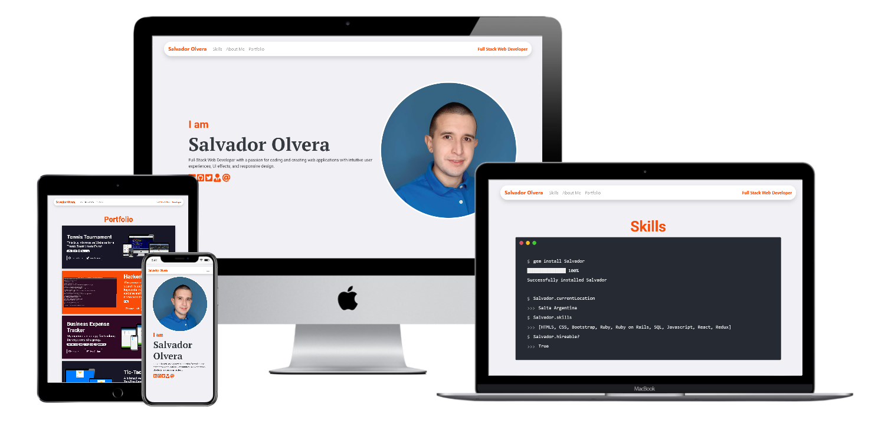

# About The Project

This portfolio was built using HTML5, CSS3, JavaScript, and Bootstraps 4, This Website was built taking care of the user experience and user interface design and responsive design.

## Built With

- HTML.
- CSS.
- JavaScript.
- Bootstrap 4.

## Resolution
### This Website has 2 breakpoint resolutions. One for mobile and the other for desktop
- Mobile: up to 768px.
- Desktop: from 768px.

## Live Demo

- [Portfolio](https://salvador-on.github.io)

## Author

**Salvador Olvera Nava**

- Github: [@Salvador-ON](https://github.com/Salvador-ON)
- Twitter: [@Salvador_ON](https://twitter.com/Salvador_ON)
- Linkedin: [Salvador Olvera](https://www.linkedin.com/in/salvador-olvera-n)